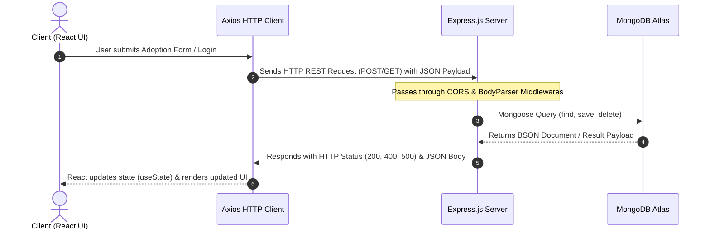

# Pet Adoption System — Technical Interview Preparation & Elevator Pitch Guide

This document contains structured, interview-ready responses to the top 10 technical interview questions for the **Pet Adoption System** full-stack project.

---

## 1. Project Elevator Pitch (1–2 Minutes)

> "The **Pet Adoption System** is a full-stack MERN application designed to streamline the pet adoption workflow by bridging pet shelters with prospective adopters.
> 
> On the client side, users can register, browse available shelter pets filtered by species (such as dogs and cats), view detailed pet profiles, and submit comprehensive adoption application forms. 
> 
> On the administrative side, the platform provides a dedicated portal where shelter admins can manage pet inventory (create, update, delete listings), review incoming adoption applications, approve or decline requests, and track overall shelter statistics via a real-time analytics dashboard.
> 
> I built the frontend using **React.js** with **React Bootstrap** and **React Router**, and developed the backend using **Node.js** and **Express.js** connected to a **MongoDB Atlas** database via **Mongoose ODM**. Passwords are encrypted using `bcrypt` hashing, and access to admin features is protected by custom client-side route guards."

---

## 2. Problem Solved & Motivation

### What Problem Does it Solve?
* **Manual & Inefficient Shelter Operations**: Traditional pet adoption relies on paper forms, in-person visits, and untracked emails, leading to delayed adoptions and missing records.
* **Lack of Centralized Inventory**: Potential adopters lack a unified digital platform to view pet details, characteristics, health info, and availability.

### Why Was it Built?
* To digitize and automate the adoption application pipeline, ensuring faster adoption cycles.
* To provide shelter managers with centralized administrative control over pet listings and applicant records.

---

## 3. Role & Key Contributions

As a **Full-Stack MERN Developer**, I designed and developed the application end-to-end:

### Key Technical Implementations
1. **Database Schema Design**: Designed 4 Mongoose models (`Users`, `Admin`, `Pets`, `Adopt`) in MongoDB Atlas.
2. **REST API Development**: Developed 15+ REST endpoints in Express.js ([server.js](file:///d:/PetAdoptionSystem/App-Pet-Adoption/Backend/server.js)) handling user/admin authentication, pet CRUD operations, and application workflows.
3. **Authentication & Password Security**: Integrated `bcrypt` salt hashing for registration and authentication routes (`/api/users/login`, `/api/admin/login`).
4. **Single Page Application UI**: Built responsive React UI components ([UserCard.jsx](file:///d:/PetAdoptionSystem/App-Pet-Adoption/Frontend/my-app/src/Components/Users/UserCard.jsx), [AdoptForm.jsx](file:///d:/PetAdoptionSystem/App-Pet-Adoption/Frontend/my-app/src/Components/AdoptPet/AdoptForm.jsx), [Petrequestlist.jsx](file:///d:/PetAdoptionSystem/App-Pet-Adoption/Frontend/my-app/src/Components/Petrequestlist/Petrequestlist.jsx)).
5. **Route Protection & Session Management**: Implemented `ProtectedRoute` and `AdminProtectedRoute` components in [App.js](file:///d:/PetAdoptionSystem/App-Pet-Adoption/Frontend/my-app/src/App.js) using browser `localStorage` state checks.

---

## 4. Technology Stack Justification

| Technology | Role | Justification / Why Chosen |
| :--- | :--- | :--- |
| **MongoDB / Mongoose** | NoSQL Database | Schema flexibility allows handling varying pet attributes and detailed adoption forms without rigid SQL table migrations. Native JSON/BSON format aligns perfectly with JavaScript payloads. |
| **Express.js** | Backend Web Framework | Minimalist, unopinionated framework providing fast REST routing, built-in middleware integration (`cors`, `bodyParser`), and clean asynchronous control flow. |
| **React.js** | Frontend Library | Component-driven architecture allows state reusability (`useState`, `useEffect`), seamless single-page navigation via React Router v6, and fast DOM updates. |
| **Node.js** | JavaScript Runtime | Enables a unified language stack (JavaScript across client and server), eliminating context switching and improving development speed. |
| **Axios** | HTTP Client | Promise-based library providing clean syntax for handling asynchronous HTTP requests, header configuration, and error catching. |

---

## 5. End-to-End Architecture & Data Flow



1. **Client Layer**: React SPA sends HTTP requests (`GET`, `POST`, `PUT`, `DELETE`) via `axios`.
2. **Server Layer**: Express.js server on port 8000 intercepts requests through middleware (`cors()`, `bodyParser.json()`) and routes them to appropriate controller handlers in [server.js](file:///d:/PetAdoptionSystem/App-Pet-Adoption/Backend/server.js).
3. **Data Layer**: Mongoose ODM communicates with MongoDB Atlas (`PetAdoptionDB`), performing document queries and returning JSON responses back to the client.

---

## 6. Most Important Feature Step-by-Step (Adoption Request Submission)

The core feature of the platform is the **End-to-End Adoption Request Workflow**:

```
[User UI] ──> Fills Form (AdoptForm.jsx) ──> POST /api/adopts ──> Express Route ──> Mongoose Save ──> Admin Table (Petrequestlist.jsx)
```

1. **Form Rendering**: Logged-in user accesses `/adopt` (guarded by `ProtectedRoute`). [AdoptForm.jsx](file:///d:/PetAdoptionSystem/App-Pet-Adoption/Frontend/my-app/src/Components/AdoptPet/AdoptForm.jsx) renders input fields.
2. **Input Capture**: User inputs details (Pet Name, Full Name, Address, Phone, Email, Home Type, Family Members, Veterinary Care commitment). Inputs update local `formData` state via `onChange` handler.
3. **Submission**: User clicks Submit. `handleSubmit` invokes `e.preventDefault()` to stop browser refresh and executes `axios.post("http://localhost:8000/api/adopts", formData)`.
4. **Backend Processing**: Express route `app.post('/api/adopts')` ([server.js:L155](file:///d:/PetAdoptionSystem/App-Pet-Adoption/Backend/server.js#L155)) receives JSON, instantiates `new Adopt(req.body)`, and persists it in MongoDB `adopts` collection.
5. **Confirmation & Redirection**: Server responds with `200 OK` `{ success: true, adoption: savedAdopt }`. React displays an alert and navigates user back to `/home`.
6. **Admin Review**: Admin opens `/Admindash` -> `/view-requests` ([Petrequestlist.jsx](file:///d:/PetAdoptionSystem/App-Pet-Adoption/Frontend/my-app/src/Components/Petrequestlist/Petrequestlist.jsx)). Frontend fetches all requests via `GET /api/adopts` and displays applicant details with "Approve" and "Decline" actions.

---

## 7. Database Design & Interaction

The database consists of 4 primary schemas in MongoDB Atlas (`PetAdoptionDB`):

1. **`Users` Collection** ([UserSchema.js](file:///d:/PetAdoptionSystem/App-Pet-Adoption/Backend/Schemas/UserSchema.js)): Stores user credentials (`username`, `email`, `password`).
2. **`admin` Collection** ([AdminSchema.js](file:///d:/PetAdoptionSystem/App-Pet-Adoption/Backend/Schemas/AdminSchema.js)): Stores administrative accounts (`name`, `email`, `password`).
3. **`Pets` Collection** ([PetSchema.js](file:///d:/PetAdoptionSystem/App-Pet-Adoption/Backend/Schemas/PetSchema.js)): Stores pet profiles (`petName`, `species`, `breed`, `age`, `gender`, `origin`, `size`, `weight`, `temperament`, `coat`, `image`).
4. **`Adopt` Collection** ([AdoptSchema.js](file:///d:/PetAdoptionSystem/App-Pet-Adoption/Backend/Schemas/AdoptSchema.js)): Stores adoption applications.

### Data Interaction Pattern
Data operations use async/await with Mongoose models:
* `Pets.find()` — Fetch all pets.
* `Users.findOne({ email })` — Check existing registration / login credentials.
* `new Adopt(req.body).save()` — Insert new adoption application.
* `Pets.deleteOne({ _id: new ObjectId(id) })` — Delete pet listing.

---

## 8. Authentication, Authorization, Validation, Error Handling & Security

* **Authentication (AuthN)**: Handled via `bcrypt` salt hashing (10 rounds). Passwords are never stored in plain text. Distinct routes exist for users (`/api/users/login`) and admins (`/api/admin/login`).
* **Authorization (AuthZ)**: React Router higher-order components (`ProtectedRoute`, `AdminProtectedRoute` in [App.js](file:///d:/PetAdoptionSystem/App-Pet-Adoption/Frontend/my-app/src/App.js)) inspect `localStorage` session state to restrict view access.
* **Validation**: Manual required-field checks on backend routes (`if (!email || !password) return res.status(400)...`) and email duplicate verification.
* **Error Handling**: Asynchronous Express route handlers are wrapped in `try...catch` blocks returning appropriate HTTP status codes (`400 Bad Request`, `404 Not Found`, `500 Server Error`).
* **Security**: Enforces CORS policy (`cors()`) to restrict cross-origin access and sanitizes inputs via React JSX escaping against XSS.

---

## 9. Biggest Technical Challenge & Solution

### Challenge: Dual-Role Authentication & Navigation Isolation
**Problem**: Managing separate login sessions and access permissions for normal users vs shelter administrators without session pollution, role confusion, or illegal page access.

**Solution**:
1. Designed separate Mongoose database collections (`Users` vs `admin`) and separate API login endpoints.
2. Isolated storage keys in browser memory (`localStorage.getItem('user')` vs `localStorage.getItem('admin')`).
3. Created dedicated React Router guard components (`ProtectedRoute` and `AdminProtectedRoute`) that inspect role-specific session keys before allowing view rendering, redirecting unauthorized attempts back to login portals.

---

## 10. Future Scalability & System Improvements

If scaling this application for production to handle thousands or millions of users:

1. **Stateless JWT Authorization**: Replace `localStorage` checks with signed **JSON Web Tokens (JWT)** stored in `HttpOnly`, `SameSite` cookies to secure API endpoints server-side against XSS attacks.
2. **Database Optimization & Caching**: Implement MongoDB read replicas and integrate **Redis** to cache pet catalog queries (`GET /api/petdata`), delivering sub-millisecond response times.
3. **Cloud Media Storage (AWS S3)**: Move pet image storage from static URLs/local paths to **AWS S3 / Cloudinary** backed by an **AWS CloudFront CDN**.
4. **Concurrency Locking**: Implement atomic Mongo operations (`Pets.findOneAndUpdate({ _id: petId, isAvailable: true }, ...)`) to prevent race conditions if multiple users request the exact same pet simultaneously.
5. **Microservices Architecture**: Decouple monolithic Express backend into containerized Docker microservices (Auth Service, Catalog Service, Adoption Service) orchestrated via Kubernetes (EKS/GKE).
