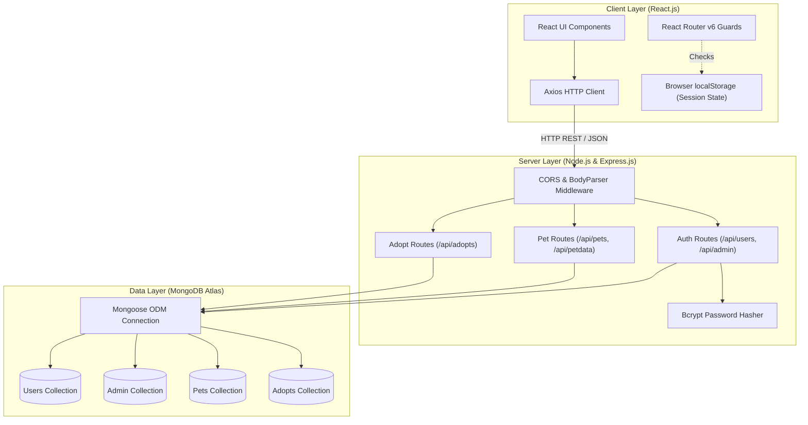
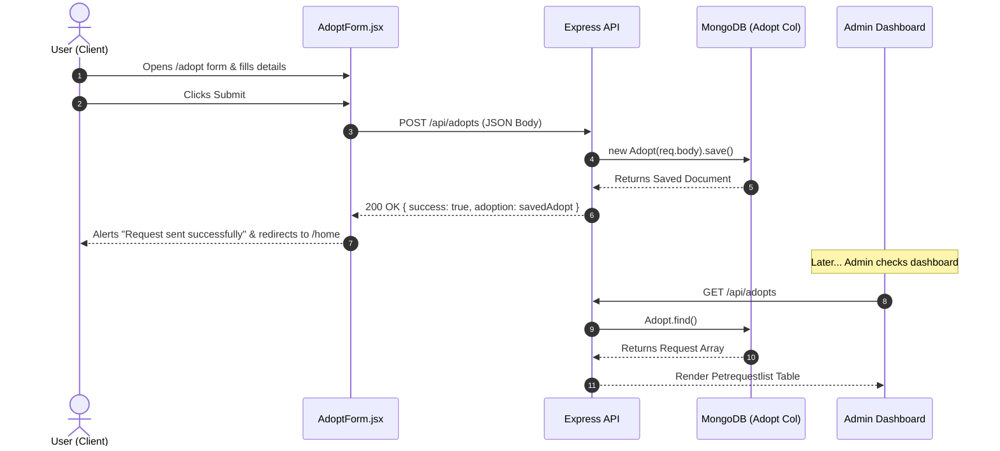
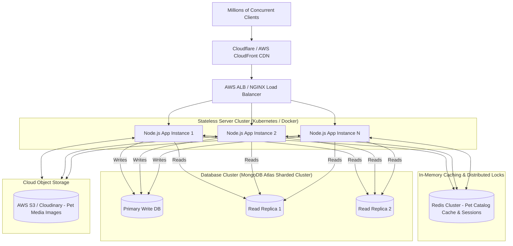

# Pet Adoption System — Comprehensive Technical Q&A & System Architecture

This document contains a complete technical overview and in-depth Q&A covering the architecture, design choices, API endpoints, security, and scalability of the **Pet Adoption System**.

---

## 1. Project Overview & Key Features

### What is the Pet Adoption System?
The **Pet Adoption System** is a full-stack web application designed to connect potential pet adopters with shelter animals needing a home. It provides a platform for users to explore available pets, submit adoption applications, and for administrators to manage pet listings and review adoption requests.

### Main Features
* **User Authentication & Authorization**: Registration and login functionality for standard users with secure password hashing (`bcrypt`).
* **Dedicated Admin Portal**: Separate authentication flow and dashboard specifically for platform administrators (`/admin`, `/Admindash`).
* **Pet Catalog Management (CRUD)**: Admins can add new pet profiles, edit details, view pet inventories, and delete pet records.
* **Category-Based Pet Browsing**: Filtered views for exploring pets by species (e.g., Dogs `/dogs`, Cats `/cats`) and full list views (`/viewPetDetails`).
* **Adoption Request Submission**: Comprehensive application form (`AdoptForm.jsx`) capturing adopter info, home environment, pet preferences, and care commitments.
* **Adoption Request Management**: Admin dashboard table (`Petrequestlist.jsx`) to review pending adoption applications and approve or decline requests.
* **Analytics Dashboard**: Real-time statistical counters (`AdminHome.jsx`) tracking total pets listed and total adoption requests submitted.
* **Protected Routes**: Client-side route guards (`ProtectedRoute`, `AdminProtectedRoute`) enforcing session controls based on user role.

---

## 2. Technology Stack & Why MERN Was Chosen

### Why MERN Stack?
The application is built on the **MERN** stack (**M**ongoDB, **E**xpress.js, **R**eact.js, **N**ode.js).

```
   ┌─────────────────────────────────────────────────────────────┐
   │                     REACT.JS (Frontend)                     │
   │  - SPA User Interface    - Axios HTTP Client               │
   │  - React Router v6       - React Bootstrap                 │
   └──────────────────────────────┬──────────────────────────────┘
                                  │ REST API (JSON)
                                  ▼
   ┌─────────────────────────────────────────────────────────────┐
   │                   EXPRESS.JS / NODE.JS                      │
   │  - REST API Routes       - Middleware (CORS, BodyParser)   │
   │  - Bcrypt Hashing        - Controller Logic                │
   └──────────────────────────────┬──────────────────────────────┘
                                  │ Mongoose ODM
                                  ▼
   ┌─────────────────────────────────────────────────────────────┐
   │                     MONGODB (Database)                      │
   │  - Users Collection      - Admin Collection                 │
   │  - Pets Collection       - Adopts Collection                │
   └─────────────────────────────────────────────────────────────┘
```

1. **MongoDB**: Offers a schema-flexible document model. Since pet characteristics (breed, species, temperament) and adoption form details can vary, MongoDB handles JSON/BSON document structures effortlessly without rigid schema migrations.
2. **Express.js**: A minimal and flexible Node.js web application framework providing robust routing and middleware capabilities for building RESTful endpoints.
3. **React.js**: A component-driven frontend library that enables a fast Single Page Application (SPA) experience with responsive state updates via React Hooks (`useState`, `useEffect`).
4. **Node.js**: Provides a unified JavaScript runtime across both frontend and backend, reducing context switching and simplifying development pipelines.

---

## 3. End-to-End System Architecture



---

## 4. Frontend-to-Backend Communication

React communicates with the Express backend using **HTTP REST APIs** over TCP via the `axios` library.

### Communication Flow
1. **Trigger**: User interacts with a React UI component (e.g., clicks "Submit" on `AdoptForm.jsx` or loads `DogDetails.jsx`).
2. **Request Execution**: React component fires an asynchronous HTTP request using Axios:
   ```javascript
   axios.post("http://localhost:8000/api/adopts", formData, {
     headers: { "Content-Type": "application/json" }
   });
   ```
3. **Express Middleware Processing**: The Express server intercepts the incoming request, applies `cors()` to validate origins, and parses the raw body into JavaScript objects via `bodyParser.json()`.
4. **Controller Logic & DB Query**: The route handler processes the data, executes database operations using Mongoose schemas, and formats the response.
5. **Response Delivery**: Backend sends back an HTTP response payload:
   ```json
   { "success": true, "adoption": { "_id": "...", "fullName": "John Doe" } }
   ```
6. **State & UI Update**: React receives the response, updates internal component state via `useState`, presents confirmation alerts, or navigates to new routes using `useNavigate()`.

---

## 5. MongoDB Database & Collection Design

The project uses **Mongoose ODM** with four primary schemas/collections in MongoDB:

```
                  ┌───────────────────────┐
                  │      PetAdoptionDB    │
                  └───────────┬───────────┘
                              │
     ┌────────────────┬───────┴────────┬────────────────┐
     ▼                ▼                ▼                ▼
┌─────────┐      ┌─────────┐      ┌─────────┐      ┌─────────┐
│  Users  │      │  Admin  │      │  Pets   │      │ Adopt   │
└─────────┘      └─────────┘      └─────────┘      └─────────┘
```

### Schema Structures

#### 1. `Users` Collection (`UserSchema.js`)
* `_id`: `ObjectId` — Unique auto-generated identifier.
* `username`: `String` (Required) — User's handle.
* `email`: `String` (Required, Unique) — Login identifier.
* `password`: `String` (Required) — Bcrypt-hashed password.

#### 2. `admin` Collection (`AdminSchema.js`)
* `_id`: `ObjectId` — Unique identifier.
* `name` / `username`: `String` — Administrator name.
* `email`: `String` — Admin email address.
* `password`: `String` — Bcrypt-hashed password.

#### 3. `Pets` Collection (`PetSchema.js`)
* `_id`: `ObjectId` — Unique pet ID.
* `petName`: `String` — Name of the pet.
* `species`: `String` — Species (Dog, Cat, etc.).
* `breed`: `String` — Breed of the animal.
* `age`, `gender`, `origin`, `size`, `weight`, `temperament`, `coat`, `lifeSpan`, `specialCharacteristics`: `String` attributes.
* `image`: `String` — Image URL or asset path.

#### 4. `Adopt` Collection (`AdoptSchema.js`)
* `_id`: `ObjectId` — Adoption request ID.
* `fullName`, `age`, `gender`, `address`, `occupation`, `phone`, `email`: Applicant personal info.
* `homeType`, `adultsInFamily`, `childrenInFamily`, `petsInHome`: Living environment context.
* `petsname`, `species`, `breed`, `agePreference`, `sizePreference`, `genderPreference`: Requested pet details.
* `timeAvailability`, `veterinaryCare` (`Boolean`), `petSupervision`, `agreement` (`Boolean`): Care policy fields.

---

## 6. Why MongoDB Over Relational Databases (MySQL)?

| Criteria | MongoDB (Chosen) | MySQL (Relational) |
| :--- | :--- | :--- |
| **Schema Structure** | Dynamic BSON documents; easily accommodates varied pet traits & form fields without migration. | Rigid tabular structure requiring `ALTER TABLE` for schema additions. |
| **Object Impedance** | Direct alignment with JSON payloads used in React frontend and Node.js backend. | Requires ORM transformations between SQL tables and JavaScript objects. |
| **Development Velocity** | Fast iteration with flexible schema definition in Mongoose. | Strict relational constraints require upfront schema locking. |
| **Horizontal Scale** | Native auto-sharding suited for large catalog scale. | Typically requires complex replication and sharding setups. |

---

## 7. User Authentication Implementation

Authentication is implemented with password security using `bcrypt`.

```
[User Signup]  ──> Plain Password ──> bcrypt.hash(saltRounds=10) ──> Hash Stored in DB
[User Login]   ──> Plain Input    ──> bcrypt.compare(input, hash) ──> Matched? Issue Session State
```

### Registration (`POST /api/users`)
1. User provides `username`, `email`, `password`.
2. Backend verifies field presence and checks if `email` already exists (`Users.findOne({ email })`).
3. Password is hashed asynchronously:
   ```javascript
   const salt = await bcrypt.genSalt(10);
   const hash = await bcrypt.hash(password, salt);
   ```
4. User record is saved to MongoDB.

### Login (`POST /api/users/login`)
1. Backend queries database for user record by `email`.
2. Compares plain text input password with stored hash:
   ```javascript
   const isMatch = await bcrypt.compare(password, user.password);
   ```
3. If valid, server responds with user profile data (`id`, `username`, `email`).
4. Frontend stores user token/object in `localStorage.setItem('user', JSON.stringify(user))`.

---

## 8. Differentiating Normal Users vs. Administrators

The application segregates normal users and administrators at multiple layers:

1. **Database & Schema Level**: Users are stored in the `Users` collection while admins are stored in the `admin` collection.
2. **API Endpoint Level**: Users register and log in via `/api/users` and `/api/users/login`. Admins authenticate via `/api/admin/register` and `/api/admin/login`.
3. **Client-Side Session Storage**: User session state is written to `localStorage.getItem('user')`, whereas admin state is written to `localStorage.getItem('admin')`.
4. **Portal Navigation & Interfaces**: Normal users land on `/home` with pet browsing and adoption application features; admins access `/Admindash` with access to add pets, view all requests, and view analytical stats.

---

## 9. Authorization for Admin-Only Operations

### Current Implementation
* **Client-Side Route Guarding**: React Router routes are guarded using custom higher-order components in `App.js`:
  ```javascript
  const AdminProtectedRoute = ({ children }) => {
    return localStorage.getItem('admin') !== null ? children : <Navigate to="/admin" />;
  };
  ```
  Routes like `/PetAddForm` and `/Admindash` are wrapped with `<AdminProtectedRoute>`.

### Production Hardening Recommendation
To ensure complete server-side security:
1. Issue **JSON Web Tokens (JWT)** on admin login containing a role claim `{ id: admin._id, role: "ADMIN" }`.
2. Implement backend Express authorization middleware (`verifyAdmin`):
   ```javascript
   const verifyAdmin = (req, res, next) => {
     const token = req.headers.authorization?.split(" ")[1];
     const decoded = jwt.verify(token, process.env.JWT_SECRET);
     if (decoded.role !== "ADMIN") return res.status(403).json({ error: "Access Denied" });
     next();
   };
   ```

---

## 10. Complete Adoption Request Workflow



---

## 11. Handling Adoption Request Approvals and Rejections

### Current Implementation
In `Petrequestlist.jsx`, both "Approve" and "Decline" actions trigger `handleRequestAction(id, action)`:
1. Calls `DELETE http://localhost:8000/api/adopts/${id}`.
2. Removes the adoption request document from MongoDB.
3. Displays a success notification ("Approved successfully!" or "Declined successfully!").
4. Updates local React state by filtering out the processed request (`requests.filter(...)`).

### Scaling / Production Flow Improvement
Rather than deleting the request upon approval:
1. **Update Request Status**: Mark `status: "Approved"` or `status: "Declined"`.
2. **Update Pet Status**: Mark pet in `Pets` collection as `isAdopted: true`.
3. **Log History**: Maintain the request in an adoption history record for auditing.
4. **Trigger Notifications**: Send automated confirmation emails to the applicant.

---

## 12. Category-Based Pet Search Implementation

Category filtering is implemented via species-level client and database queries:

1. **Frontend Filtering (`DogDetails.jsx` / `CatDetails.jsx`)**:
   * Fetches pet data from backend endpoint `GET /api/petdata`.
   * Filters results dynamically during rendering:
     ```javascript
     {dogData.map((data) => data.species === "Dog" && <Dogcard key={data._id} dogs={data} />)}
     ```
2. **Optimized Backend Filtering (Recommended API Pattern)**:
   * Query parameters can filter at database execution:
     ```javascript
     app.get("/api/pets/category", async (req, res) => {
       const { species } = req.query;
       const filteredPets = await Pets.find({ species: new RegExp(species, "i") });
       res.status(200).json(filteredPets);
     });
     ```

---

## 13. Adoption History Tracking

### Current Approach
* Adoption applications are stored in the `adopts` collection upon creation.
* The system counts historical submissions using `GET /api/adopts/count` (`Adopt.countDocuments()`).

### Scaled History Architecture
To track historical pet adoptions comprehensively over time:
1. **Adoption History Schema**:
   * `userId`: `Ref -> Users`
   * `petId`: `Ref -> Pets`
   * `status`: `String` (`Pending`, `Approved`, `Rejected`)
   * `processedBy`: `Ref -> Admin`
   * `timestamp`: `Date`
2. **Audit Logging**: Maintain historical records even if a pet listing is archived or removed.

---

## 14. API Endpoints & HTTP Methods

| Endpoint | Method | Description | Access Level |
| :--- | :--- | :--- | :--- |
| `GET /` | `GET` | Server Health Check / Root Status | Public |
| `POST /api/users` | `POST` | Register a new user account | Public |
| `POST /api/users/login` | `POST` | Authenticate user & start session | Public |
| `POST /api/admin/register` | `POST` | Register a new administrator | Admin |
| `POST /api/admin/login` | `POST` | Authenticate admin user | Admin |
| `GET /api/admin` | `GET` | Fetch all admin accounts | Admin |
| `POST /api/admin` | `POST` | Create admin account | Admin |
| `GET /api/petdata` | `GET` | Retrieve full pet catalog | Authenticated User / Admin |
| `POST /api/pets` | `POST` | Create a new pet listing | Admin |
| `PUT /api/pets/update/:id` | `PUT` | Update pet listing details | Admin |
| `DELETE /api/pets/delete/:id` | `DELETE` | Delete a pet listing | Admin |
| `GET /api/pets/count` | `GET` | Get total count of pets | Admin |
| `GET /api/adopts` | `GET` | Retrieve all adoption requests | Admin |
| `POST /api/adopts` | `POST` | Submit adoption application | Authenticated User |
| `DELETE /api/adopts/:id` | `DELETE` | Resolve/Delete adoption request | Admin |
| `GET /api/adopts/count` | `GET` | Get total count of requests | Admin |

---

## 15. Express.js Middleware & Project Usage

### What is Middleware?
Middleware functions in Express.js execute during the request-response lifecycle. They have access to the request object (`req`), response object (`res`), and the `next` function in the middleware stack.

```
Incoming Request ──> [ CORS Middleware ] ──> [ BodyParser Middleware ] ──> [ Route Handler ] ──> Response
```

### Middleware Used in the Project
1. **`cors()`**: Configures Cross-Origin Resource Sharing headers, enabling frontend React client (`localhost:3000`) to communicate with the Express backend (`localhost:8000`).
2. **`bodyParser.json()`**: Parses incoming JSON request payloads into JavaScript objects accessible via `req.body`.
3. **`bodyParser.urlencoded({ extended: true })`**: Parses URL-encoded data from HTML form submissions.
4. **`express.static("./frontend/my-app/public")`**: Serves static frontend assets for single-server production builds.

---

## 16. Validation and Error Handling

### Backend Validation Strategy
* **Required Field Checks**: Route handlers inspect incoming parameters before executing database operations:
  ```javascript
  if (!username || !email || !password) {
    return res.status(400).json({ success: false, error: 'All fields are required' });
  }
  ```
* **Uniqueness Validation**: Checks database for existing email registrations (`Users.findOne({ email })`).

### Error Handling & HTTP Status Codes
All asynchronous handlers use `try...catch` blocks to prevent unhandled promise rejections:
* `400 Bad Request`: Input validation failures or duplicate account registrations.
* `404 Not Found`: Resource target missing during update/delete queries.
* `500 Internal Server Error`: Catch-all block logging database/server execution errors while returning JSON error messages.

---

## 17. Security & Protection Against Common Attacks

### Implemented Protections
1. **Password Security**: Uses `bcrypt` with salt rounds set to `10` to defend against dictionary and rainbow table attacks.
2. **CORS Restrictions**: Prevents unauthorized domains from making cross-origin REST requests.
3. **Session Guards**: React Router protected components restrict unauthenticated view rendering.

### Additional Security Enhancements
* **MongoDB Injection Defense**: Use Mongoose strict query schemas and sanitize user inputs using `express-mongo-sanitize`.
* **XSS (Cross-Site Scripting)**: React automatically escapes HTML content rendered in JSX.
* **Rate Limiting**: Integrate `express-rate-limit` on login endpoints (`/api/users/login`, `/api/admin/login`) to block brute-force attacks.
* **HTTP Security Headers**: Utilize `helmet` middleware to set security HTTP headers.

---

## 18. Technical Challenges & Solutions

### Challenge: Dual-Role Authentication & Session Management
**Problem**: Managing distinct login systems for regular users and admins without context collision, session leakage, or unintended access to administrative pages.

**Solution**:
1. Built separate Mongoose schemas (`UserSchema` vs `AdminSchema`) and authentication endpoints.
2. Created separate client storage tokens (`localStorage.getItem('user')` vs `localStorage.getItem('admin')`).
3. Implemented isolated route wrapper guards (`ProtectedRoute` vs `AdminProtectedRoute`) that inspect role-specific keys before allowing navigation.

---

## 19. Handling Concurrent Adoption Requests (Race Conditions)

### Scenario
Two users attempt to adopt the exact same pet at the same instant.

```
User A ──── (0.00s Submit Request) ────┐
                                       ├─► [Race Condition!] ─► Both see "Available"
User B ──── (0.01s Submit Request) ────┘
```

### Solution Strategies

#### 1. Atomic Database Operations (Optimistic Locking)
Use Mongoose atomic update logic so only one request transitions pet availability:
```javascript
const updatedPet = await Pets.findOneAndUpdate(
  { _id: petId, isAvailable: true },
  { isAvailable: false, status: "Pending_Approval" },
  { new: true }
);

if (!updatedPet) {
  return res.status(409).json({ success: false, error: "Pet has already been requested by another user." });
}
```

#### 2. MongoDB ACID Transactions
Wrap adoption request creation and pet status updates inside a single MongoDB session transaction (`session.withTransaction()`). If one operation fails, all changes roll back atomically.

#### 3. Distributed Lock (Redis Redlock)
Acquire a temporary lock on the specific `petId` key in Redis when processing adoption submissions:
```javascript
const lock = await redlock.acquire([`locks:pet:${petId}`], 5000);
// Process adoption request logic...
await lock.release();
```

---

## 20. System Scaling & High Availability Architecture

To scale the Pet Adoption System to handle millions of active users and high throughput, the following architectural upgrades would be implemented:



### Recommended Improvements for Scale
1. **Stateless JWT Authentication**: Shift from `localStorage` check to signed JWTs in `HttpOnly`, `SameSite` cookies, allowing stateless authorization across load-balanced Node.js clusters.
2. **Database Sharding & Read Replicas**: Configure MongoDB replica sets for read/write splitting. Route catalog read queries (`GET /api/petdata`) to secondary read replicas.
3. **Redis In-Memory Caching**: Cache pet catalog listings and count statistics in Redis to achieve sub-millisecond responses for read-heavy traffic.
4. **Cloud Media Storage (S3 / Cloudinary)**: Offload pet image assets to cloud object storage delivered over CDN networks.
5. **Microservices Architecture**: Decouple monolithic Express backend into independent microservices (Auth Service, Pet Catalog Service, Adoption Processing Service) deployed on Kubernetes (EKS/GKE) with auto-scaling capabilities.
